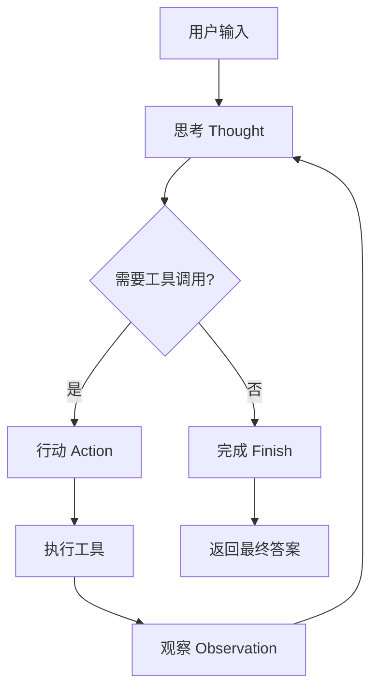

# MyAgentDemo - 基于ReAct模式的智能体框架

<p align="center">
  
  
  
  
</p>

## 📖 项目简介

**MyAgentDemo** 是一个基于 **ReAct（推理-行动）模式** 的智能体框架，支持工具调用和推理执行。该框架实现了完整的 Thought-Action-Observation 循环，允许智能体理解用户需求、规划任务步骤、调用多种工具，并执行复杂的多轮工作流。项目设计注重简洁性、可扩展性和实用性，适用于自动化任务处理、信息搜索、文件操作等多种场景。

### 🎯 设计理念

- **ReAct模式为核心**：严格遵循"思考(Thought)-行动(Action)-观察(Observation)"的循环执行模式
- **模块化架构**：清晰的组件分离，便于维护和扩展
- **安全第一**：对潜在危险操作（如终端命令执行）提供用户确认机制
- **标准化输出**：强制统一的输出格式，便于程序化解析和处理

## ✨ 核心特性

### 🧠 完整的ReAct模式实现
- **思考-行动循环**：智能体能够将复杂任务分解为可执行的步骤序列
- **工具调用机制**：动态选择和调用合适的工具完成任务
- **状态保持**：在多轮对话中维护完整的执行历史和上下文
- **最大迭代控制**：防止无限循环，默认最大5次迭代

### 🛠️ 灵活的工具系统
- **多种内置工具**：
  - 🌤️ 天气查询 (`get_weather`) - 基于wttr.in API，查询真实天气数据
  - 🔍 网络搜索 (`search_web`) - 基于Tavily搜索API，获取最新信息
  - 📍 景点推荐 (`get_attraction`) - 结合天气和地理位置推荐旅游景点
  - 📁 文件操作 (`readFile`/`writeFile`) - 读取和写入本地文件
  - 💻 终端命令 (`runTerminalCommand`) - 安全执行系统命令
- **可扩展设计**：轻松添加自定义工具函数

### 🔌 多LLM提供商支持
- **统一客户端接口**：抽象化不同LLM服务商的API差异
- **工厂模式设计**：通过环境变量自动创建对应LLM客户端
- **当前支持**：
  - OpenAI兼容接口（DeepSeek、OpenAI官方、Modelscope等）
  - Anthropic Claude兼容接口
- **易于扩展**：支持添加新的LLM服务提供商

### 🔒 安全特性
- **命令执行确认**：执行终端命令前要求用户确认
- **错误处理**：完善的异常捕获和用户友好提示
- **配置隔离**：通过环境变量管理敏感信息
- **输入验证**：对用户输入进行基本验证和处理

## 🚀 快速开始

### 环境要求
- Python 3.14 或更高版本
- UV包管理器（推荐）或pip

### 安装步骤

1. **克隆项目**
```bash
git clone https://github.com/ZXP3220180336/MyAgentDemo.git
cd MyAgentDemo
```

2. **安装依赖（使用UV - 推荐）**
```bash
# 安装UV（如未安装）
pip install uv

# 同步依赖
uv sync
```

3. **或使用pip安装依赖**
```bash
pip install python-dotenv openai anthropic tavily-python requests
```

3. **配置环境变量**
```bash
# 复制环境变量模板
cp .env.example .env

# 编辑.env文件，填入您的API密钥
# 详细配置说明见下方"配置说明"章节
```

4. **运行智能体**
```bash
# 直接运行主程序
python main.py
```

5. **交互式使用**
程序启动后，您可以输入旅游相关查询，例如：
- "帮我查询北京的天气"
- "推荐上海的历史文化景点" 
- "杭州有什么适合家庭游玩的地方？"
输入"退出"或"exit"结束程序。

## 🏗️ 架构概览

### 系统架构图

```
┌─────────────────────────────────────────┐
│          应用层 (main.py)               │
│     控制台交互入口，用户输入处理        │
├─────────────────────────────────────────┤
│          智能体层 (Agent.py)            │
│   ReAct循环控制、对话历史管理、行动解析 │
├─────────────────────────────────────────┤
│   工具层 (Tools.py)   │   LLM客户端层   │
│   ┌──────────────┐    │  (LLMClient.py) │
│   │• 天气查询    │    │  • OpenAI兼容   │
│   │• 网络搜索    │    │  • Anthropic    │
│   │• 景点推荐    │    │  • 工厂模式     │
│   │• 文件操作    │    │  • 可扩展接口   │
│   │• 终端命令    │    └─────────────────┘
│   └──────────────┘
├─────────────────────────────────────────┤
│          系统提示层                      │
│      (agent_system_prompt.py)           │
│   行为规范、格式控制、工具说明          │
├─────────────────────────────────────────┤
│          配置层                          │
│     (.env, .env.example, pyproject.toml)│
│     环境变量、依赖管理、项目配置        │
└─────────────────────────────────────────┘
```

### 核心模块说明

| 模块 | 文件 | 主要职责 |
|------|------|----------|
| **智能体核心** | `AgentDemo/Agent.py` | 实现ReAct循环、解析行动、管理对话历史、工具调用 |
| **工具集合** | `AgentDemo/Tools.py` | 提供各种工具函数，支持天气查询、网络搜索、文件操作等 |
| **LLM客户端工厂** | `AgentDemo/LLMClient.py` | LLM客户端工厂模式，支持多服务提供商，根据环境变量自动创建 |
| **系统提示词** | `AgentDemo/agent_system_prompt.py` | 定义智能体行为规范和输出格式，强制ReAct格式 |
| **模块导出** | `AgentDemo/__init__.py` | 提供简洁的导入接口，导出核心类和函数 |
| **主程序** | `main.py` | 控制台交互入口，用户输入处理循环 |

### ReAct工作流程



## 📝 详细使用指南

### 基础使用示例

```python
import os
from dotenv import load_dotenv
from AgentDemo import LLMClientFactory, available_tools, Agent, AGENT_SYSTEM_PROMPT

# 加载环境变量
load_dotenv()

# 初始化LLM客户端（根据.env配置自动创建）
llm_client = LLMClientFactory.create_from_env()

# 创建智能体实例
agent = Agent(available_tools=available_tools, llmClient=llm_client)

# 运行智能体任务
task = "查询今天北京的天气，然后根据天气推荐一个旅游景点"
agent.run_assistant(user_input=task, system_prompt=AGENT_SYSTEM_PROMPT)
```

### 控制台使用示例

运行 `python main.py` 启动智能旅游助手，支持以下类型的查询：

1. **天气查询与景点推荐**
   ```
   请输入查询内容: 帮我查询北京的天气，然后推荐一个景点
   ```

2. **旅游信息搜索**
   ```
   请输入查询内容: 搜索上海有哪些历史文化景点
   ```

3. **文件操作任务**
   ```
   请输入查询内容: 读取当前目录下的README.md文件
   ```

4. **组合任务**
   ```
   请输入查询内容: 查询杭州天气，根据天气推荐适合家庭游玩的地方，并保存推荐结果到recommendation.txt
   ```

### 工具调用机制

智能体通过严格的格式解析工具调用：

```python
# LLM输出格式（由系统提示词强制控制）
Thought: 需要查询北京今天的天气
Action: get_weather(city="北京")

# Agent解析并执行
tool_name, kwargs = agent.parse_action("get_weather(city=\"北京\")")
# tool_name = "get_weather", kwargs = {"city": "北京"}

# 调用工具
result = available_tools[tool_name](**kwargs)
# result = "北京当前天气：晴朗，气温25摄氏度"
```

### 代码格式化功能

Agent类内置代码格式化功能，自动美化生成的代码：

```python
# 自动格式化HTML代码
formatted_html = agent.format_code(
    content='<html><body><h1>Hello World</h1></body></html>',
    file_path='index.html'
)

# 输出结果：
# <html>
#   <body>
#     <h1>Hello World</h1>
#   </body>
# </html>
```

支持的文件类型：
- `.html` - HTML文件，自动缩进标签
- `.css` - CSS文件，美化样式规则
- `.js` - JavaScript文件，基础代码格式化

## ⚙️ 配置说明

### 环境变量配置

项目使用`.env`文件管理配置，支持多种LLM服务。复制`.env.example`为`.env`并填写实际API密钥：

```env
# ========== Tavily API 配置 ==========
# 用于网络搜索功能，注册地址：https://tavily.com
TAVILY_API_KEY=your_tavily_api_key_here

# ========== LLM API 配置（根据LLMClient.py工厂类设计） ==========
# LLMClientFactory.create_from_env() 使用以下环境变量：

# API类型：openai (OpenAI兼容接口) 或 anthropic (Anthropic Claude API)
LLM_API_TYPE=openai

# 模型名称，根据选择的API类型填写：
# - OpenAI兼容服务: gpt-3.5-turbo, gpt-4, deepseek-chat, qwen-max 等
# - Anthropic服务: claude-3-haiku-20240307, claude-3-sonnet-20240229, claude-3-opus-20240229 等
LLM_MODEL=deepseek-chat

# API密钥，从对应服务商获取
LLM_API_KEY=sk-your-deepseek-api-key-here

# API基础URL，根据服务商填写：
# - OpenAI官方: https://api.openai.com/v1
# - DeepSeek: https://api.deepseek.com
# - Anthropic官方: https://api.anthropic.com
LLM_BASE_URL=https://api.deepseek.com

# ========== 可选配置 ==========
# 最大迭代次数（防止无限循环）
MAX_ITERATIONS=5
```

### 依赖管理

项目使用 `pyproject.toml` 和 `uv` 进行依赖管理：

```toml
[project]
name = "code"
version = "0.1.0"
description = "基于ReAct模式的智能体框架"
readme = "README.md"
requires-python = ">=3.14"
dependencies = [
    "anthropic>=0.94.0",    # Anthropic Claude SDK
    "openai>=2.31.0",       # OpenAI SDK（用于兼容API）
    "tavily-python>=0.7.23", # Tavily搜索API
    "requests>=2.33.1",     # HTTP请求库
    "python-dotenv>=1.2.2", # 环境变量管理
    "ipykernel>=7.2.0",     # Jupyter内核支持
]
```

### VS Code开发配置

项目包含VS Code配置（`.vscode/settings.json`）：

```json
{
    "editor.formatOnSave": true,
    "files.autoSave": "afterDelay",
    "editor.defaultFormatter": "charliermarsh.ruff",
    "editor.formatOnPaste": true,
    "python.analysis.autoImportCompletions": true
}
```

## 🛠️ 扩展开发

### 添加新工具

1. **在Tools.py中定义新函数**

```python
def new_custom_tool(param1: str, param2: int) -> str:
    """
    自定义工具的描述
    
    Args:
        param1: 参数1说明
        param2: 参数2说明
    
    Returns:
        工具执行结果的字符串描述
    """
    try:
        # 工具实现逻辑
        result = f"处理结果: {param1} * {param2} = {param1 * param2}"
        return result
    except Exception as e:
        return f"错误：执行工具时发生问题 - {e}"
```

2. **注册到available_tools字典**

```python
# 在Tools.py文件末尾的available_tools字典中添加
available_tools = {
    # ... 现有工具 ...
    "new_custom_tool": new_custom_tool,
}
```

3. **更新系统提示词**

在`agent_system_prompt.py`中的"可用工具"部分添加说明：
```python
# 可用工具:
# ...
# - `new_custom_tool(param1: str, param2: int)`: 自定义工具的描述。
```

### 添加新LLM客户端

项目使用工厂模式管理LLM客户端，添加新客户端需要以下步骤：

1. **创建新的客户端类（继承LLMClient基类）**

```python
# 在LLMClient.py中添加
from .LLMClient import LLMClient

class NewLLMClient(LLMClient):
    """
    新的LLM服务客户端，需继承LLMClient并实现generate方法
    """
    def __init__(self, model: str, api_key: str, base_url: str):
        super().__init__(model, api_key, base_url)
        # 初始化第三方客户端
        self.client = ThirdPartyClient(api_key=api_key, base_url=base_url)
    
    def generate(self, user_prompt: str, system_prompt: str) -> str:
        """调用LLM API生成回应，必须返回字符串"""
        print("正在调用大语言模型...")
        try:
            # 调用第三方API
            response = self.client.chat.completions.create(
                model=self.model,
                messages=[
                    {"role": "system", "content": system_prompt},
                    {"role": "user", "content": user_prompt}
                ]
            )
            answer = response.choices[0].message.content
            print("大语言模型响应成功。")
            return answer if answer else "抱歉，未能生成有效回答。"
        except Exception as e:
            print(f"调用LLM API时发生错误: {e}")
            return "错误：调用语言模型服务时出错。"
```

2. **在LLMClientFactory中添加支持**

```python
# 在LLMClient.py的LLMClientFactory类中添加
class LLMClientFactory:
    """LLM客户端工厂类，用于创建合适的客户端"""
    
    @staticmethod
    def create_client(api_type: str = "openai", **kwargs) -> LLMClient:
        # ... 现有代码 ...
        
        if api_type == "new_provider":
            return NewLLMClient(
                model=model or "default-model",
                api_key=api_key or "demo_key",
                base_url=base_url or "https://api.newprovider.com",
            )
        elif api_type == "anthropic":
            # ... 现有代码 ...
        else:
            # ... 现有代码 ...
```

3. **更新环境变量支持**
在`.env.example`中添加新提供商的配置示例：
```env
# 新LLM提供商配置
# LLM_API_TYPE=new_provider
# LLM_MODEL=default-model
# LLM_API_KEY=your_new_provider_api_key
# LLM_BASE_URL=https://api.newprovider.com
```

### 修改系统提示词

系统提示词在`agent_system_prompt.py`中定义，控制智能体的行为：

- **修改输出格式**：调整"输出格式强制要求"部分
- **添加工具说明**：更新"可用工具"部分的描述
- **调整示例**：修改"标准示例"以更好地引导LLM
- **更新环境信息**：修改"环境信息"以反映实际运行环境

## 📁 项目结构

```
MyAgentDemo/
├── AgentDemo/                    # 核心模块目录
│   ├── __init__.py              # 模块导出（简化导入）
│   ├── Agent.py                 # 智能体核心类（ReAct实现）
│   ├── LLMClient.py             # LLM客户端工厂模式
│   ├── Tools.py                 # 工具函数集合
│   └── agent_system_prompt.py   # 系统提示词定义
├── main.py                      # 控制台应用主入口
├── pyproject.toml              # 项目配置和依赖声明
├── uv.lock                     # 依赖锁定文件（UV）
├── .env.example                # 环境变量配置模板
├── .vscode/                    # VS Code配置
│   └── settings.json          # 编辑器设置
├── .gitignore                  # Git忽略文件配置
├── CLAUDE.md                   # 项目文档和开发规范
└── README.md                   # 本文档
```

### 核心文件说明

| 文件路径 | 重要性 | 主要功能 |
|----------|--------|----------|
| `AgentDemo/Agent.py` | 🔴 核心 | 智能体主类，实现ReAct循环、行动解析、工具调用 |
| `AgentDemo/Tools.py` | 🔴 核心 | 工具函数集合，支持天气查询、网络搜索、文件操作等 |
| `AgentDemo/LLMClient.py` | 🟡 重要 | LLM客户端工厂模式，支持多提供商，根据环境变量自动创建 |
| `AgentDemo/agent_system_prompt.py` | 🟡 重要 | 系统提示词，控制智能体行为，强制ReAct格式 |
| `main.py` | 🟢 重要 | 控制台应用主入口，用户交互循环 |
| `pyproject.toml` | 🟢 配置 | 项目依赖和元数据配置 |
| `.env.example` | 🟡 重要 | 环境变量配置模板，需复制为`.env`使用 |
| `CLAUDE.md` | 🟢 配置 | 项目文档和开发规范 |

## 🧪 开发指南

### 代码规范

1. **类型注解**：所有函数都应包含类型注解
   ```python
   def example_function(param1: str, param2: int) -> str:
       """函数说明"""
       return f"Result: {param1}-{param2}"
   ```

2. **文档字符串**：使用Google风格的docstring
   ```python
   def example_function(param1: str, param2: int) -> str:
       """
       函数简要说明
       
       Args:
           param1: 参数1的详细说明
           param2: 参数2的详细说明
           
       Returns:
           返回值的详细说明
           
       Raises:
           ValueError: 当参数无效时
       """
   ```

3. **错误处理**：完善的异常捕获和用户友好提示
   ```python
   try:
       result = some_operation()
       return f"成功: {result}"
   except SpecificError as e:
       return f"错误：发生特定错误 - {e}"
   except Exception as e:
       return f"错误：执行操作时发生问题 - {e}"
   ```

### 测试建议

1. **工具函数测试**：为每个工具函数编写单元测试
2. **智能体流程测试**：测试完整的ReAct循环流程
3. **集成测试**：测试与外部API的集成
4. **端到端测试**：测试完整的任务执行流程

### 调试技巧

1. **启用详细日志**：在Agent类中添加调试输出
2. **检查提示词**：确保系统提示词格式正确
3. **验证API响应**：检查LLM返回的格式是否符合预期
4. **工具调用调试**：单独测试工具函数是否正常工作

## ❓ 常见问题

### Q: 智能体不执行工具调用，总是直接返回Finish
**A**: 检查系统提示词中的工具说明是否完整，确保LLM理解可用工具的功能和调用格式。

### Q: 终端命令执行被阻止
**A**: 这是设计上的安全特性。执行`runTerminalCommand`时会要求用户确认。如需自动化，可修改Agent.py中的安全确认逻辑。

### Q: LLM返回的格式不符合要求
**A**: 确保系统提示词中的格式要求清晰明确，可尝试在提示词中添加更多示例。

### Q: 如何切换不同的LLM服务商？
**A**: 修改`.env`文件中的`LLM_API_TYPE`、`LLM_MODEL`、`LLM_API_KEY`、`LLM_BASE_URL`配置，或使用`LLMClientFactory.create_client()`直接创建客户端。

### Q: 添加新工具后智能体不识别
**A**: 确保：
1. 工具函数已正确添加到`available_tools`字典
2. 系统提示词中已添加工具说明
3. 工具函数签名符合要求（参数名、类型、返回值）

### Q: 代码格式化功能不起作用
**A**: 检查文件扩展名是否正确，目前仅支持`.html`、`.css`、`.js`文件。

### Q: 使用UV安装依赖失败
**A**: 确保已安装UV (`pip install uv`)，或使用pip直接安装依赖：`pip install python-dotenv openai anthropic tavily-python requests`

### Q: 环境变量配置不正确
**A**: 复制`.env.example`为`.env`，填写正确的API密钥。确保变量名与代码中读取的一致（`LLM_API_TYPE`、`LLM_MODEL`等）。

## 🤝 贡献指南

我们欢迎各种形式的贡献！

### 报告问题
1. 在GitHub Issues中搜索是否已存在相关问题
2. 创建新Issue，详细描述问题现象、复现步骤、期望行为
3. 附上相关日志或错误信息

### 提交改进
1. Fork本仓库
2. 创建特性分支 (`git checkout -b feature/amazing-feature`)
3. 提交更改 (`git commit -m 'Add some amazing feature'`)
4. 推送到分支 (`git push origin feature/amazing-feature`)
5. 创建Pull Request

### 开发规范
1. 遵循现有的代码风格和结构
2. 为新功能添加测试用例
3. 更新相关文档（README.md、代码注释等）
4. 确保所有测试通过

### 代码审查
- Pull Request需要至少一位维护者审查通过
- 代码应清晰、可维护、有适当的注释
- 新增功能应有相应的测试覆盖

## 📄 许可证

本项目采用 **MIT 许可证** - 查看 [LICENSE](LICENSE) 文件了解详情。

## 🙏 致谢

- **ReAct论文**：本项目灵感来源于《ReAct: Synergizing Reasoning and Acting in Language Models》
- **开源社区**：感谢所有开源项目的贡献者
- **API服务商**：感谢OpenAI、Anthropic、DeepSeek、Tavily等提供的API服务
- **工具开发者**：感谢python-dotenv、requests、uv等优秀工具库的开发者

## 📞 支持与联系

- **GitHub Issues**: [报告问题或请求功能](https://github.com/ZXP3220180336/MyAgentDemo/issues)
- **文档**: 本文档和代码注释
- **示例**: 查看 `main.py` 获取完整使用示例

---

<p align="center">
  <em>如果这个项目对您有帮助，请给个⭐️ Star支持！</em>
</p>

<p align="center">
  
</p>